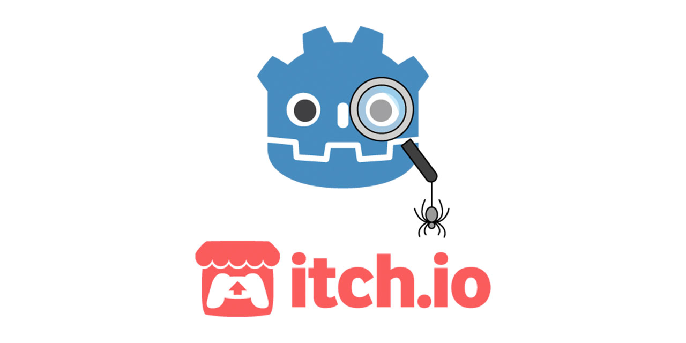

# itch.io Godot Scraper

[](https://github.com/hiulit/itchio-godot-scraper/blob/master/LICENSE)

A scraper for Godot games hosted on https://itch.io/.



## API URL

https://itchio-godot-scraper.vercel.app/api

Auto updated every day at 12:00 CET.

## Usage

- `/api` - Get all the games.
- `/api/games` - Get all the games titles.
- `/api/game/title/:title` - Get game by title.
- `/api/game/id/:id` - Get game by id.
- `/api/authors` - Get all the authors.
- `/api/authors/top/:number` - Get top authors by game count.
- `/api/author/:author` - Get games by author.
- `/api/platforms` - Get all the platforms.
- `/api/platforms/:platform` - Get games by platform.

## How does the scraper finds games

To find a specific game, the scraper uses `/api/game/title/:title`.

What the scrapes does is take `:title` parameter and split it in words, following some conventions (see below). Then it looks for all the games that have those words in it, and returns the one that have the more words.

For the scraper to be able find the game, the game's title (and particularly the game's build name) needs to follow any of these conventions:

- It must be camelCase (e.g. `thisIsMyGame`).
- It must use dashes or underscores (e.g. `this-is-my-game` or `this_is_my_game`).
- It must use spaces (e.g `this is my game`).
- It must use dots (e.g. `this.is.my.game`).

## Troubleshooting

### The scraper can't find a game

For the scraper to be able to find a game, the game's build name must follow these conventions:

- It must have the game's title in it (it may seem obvious but some game builds doesn't match with the game's title at all).
- It must follow any of the conventions above.

## Development

### Prerequisites

* [Git](https://git-scm.com/) installed on your computer.
* [Node.js](https://nodejs.org/en/) installed on your computer.

### Installation

```bash
# Clone the repository.
git clone https://github.com/hiulit/itchio-godot-scraper.git
# Go to the repository folder.
cd itchio-godot-scraper
# Create a temporary folder, needed for some files.
mkdir .tmp
# Install the node modules.
npm install
```

### Usage

* Run `npm start` to start the production environment.  
This will use the data from https://raw.githubusercontent.com/hiulit/itchio-scraper/master/all.json.
* Run `npm run dev` to start the development environment.  
This will use the local `all.json` generated by the `update-games.js` script.  
Use this environment to develop/test new features.
* Run `npm run update-games` to scrape all the Godot games from https://itch.io and store them in `all.json`.

## License

[MIT License](LICENSE).
